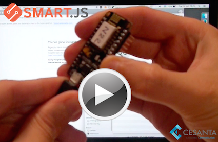

Mongoose IoT is a cross-platform, full-stack Internet of Things software
platform that allows you to connect devices online easily and quickly.
The device part of Mongoose IoT provides JavaScript-enabled firmware
thanks to the very small
[V7 JavaScript engine](https://docs.cesanta.com/v7/dev/).
This means that the device logic can be written as a small JavaScript
snippet using a simple JavaScript API. The API is documented at
[Mongoose IoT JS API](https://docs.cesanta.com/mongoose-iot/latest/).

Mongoose IoT also provides a
[cloud service](https://cloud.cesanta.com)
with rich API, including
device registry, timeseries database for storing
telemetry data, Publish Subscribe service, online IDE
for developing end-user Web app and more.
Mongoose IoT cloud service also makes it easy to integrate with
3rd party clouds, like Amazon IoT, Microsoft Azure, etc.

Take a look at 2 minute video that shows Mongoose IoT in action:

