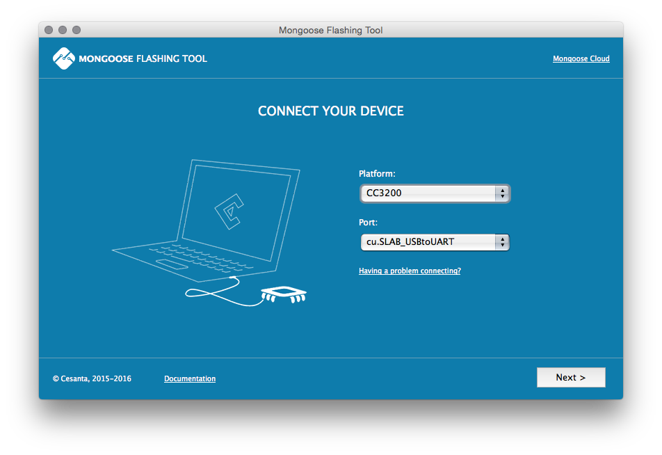

- Login to the [Mongoose IoT Cloud](https://mongoose-iot.com)
- Navigate to Smart Light example project
- Read the summary page
- Find and install Mongoose Mobile app on Google Play. This app will
  demonstrate how to control remote device via the Mongoose Mobile app
- Click on the "clone project" stripe at the top right. This clones this
  example project into your own private copy which you can modify
- Navigate to DEVICES tab
- If you don't have a real device,
    - Click on "Add Device" button.
    - Select virtual device and click Add
- If you do have a real device,
    - Download flashing tool from https://github.com/cesanta/mft/releases
    - Follow Mongoose Flashing tool wizard to flash Mongoose firmware
      to your device and connect it to Mongoose Cloud 
      
    - Connect an LED to GND and GPIO5 pins
    - FTDI USB drivers are at
    [FTDI website](http://www.ftdichip.com/Drivers/VCP.htm)
    - Drivers for NodeMCU v1 board is at
      [Silabs CP2102 page](https://www.silabs.com/products/mcu/Pages/USBtoUARTBridgeVCPDrivers.aspx)
- New device should appear in the device list. Copy it's ID to the clipboard
- Navigate to the IDE tab
- Click on `mobile_app/config.yaml` to edit mobile configuration - substitute
  DEVICE_ID with the device ID from the clipboard
- If you're using real device, click on Flash button to build and flash
  Smart Light firmware to your device
- Open Mongoose Mobile app. Use the UI to switch LED on/off.
