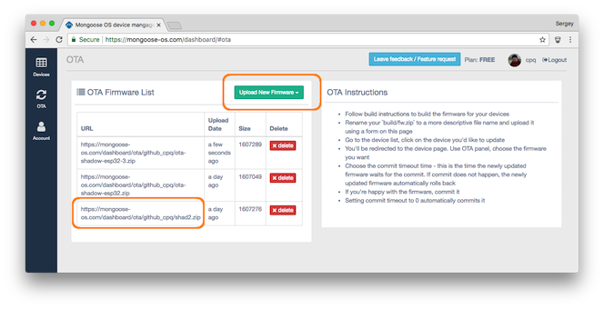

# OTA firmware update via the device shadow


## Overview

This library provides a way to update firmware Over-The-Air via the device
shadow mechanism.

In the text below, AWS IoT Shadow will be used.

It works by observing the `ota.url` entry in the device shadow. That entry must
be an URL with the valid Mongoose OS firmware, which is a .zip file.
When that entry is changed, this library downloads a firmware from that
URL and kicks off an OTA update. The sequence of actions is as follows:

- Receive shadow delta for `ota.url` - a new `ota.url` value
- Compare `ota.url` with file on flash. If it is the same as new value, stop
- If it is different, save new `ota.url` locally on flash
- Report new `ota_url`
- Trigger an OTA by downloading the .zip
- During the process, report numeric `ota.code` and string `ota.message`
  entries which indicates the status of the OTA in nearly real time
- On any failure, stop with the failure `ota.message`
- On success, reboot to the new firmware
- After reboot, commit the new firmware after the successful AWS IoT handshake
- If AWS IoT handshake does not happen during 5 minutes (the default commit
  timeout), rollback to the old firmare
- OTA failure keeps the `ota.url` delta uncleared

## How to trigger an OTA firmware update

Build and flash the https://github.com/mongoose-os-apps/demo-js app,
start the console, and provision to AWS IoT. Open the shadow GUI for the
device.

Upload built firmware to the
[Mongoose OS dashboard](https://mongoose-os.com/docs/mdash/intro.md)
and copy the firmware URL.



Change the `desired` shadow state by adding a section `ota` with `url` key:

```javascript
{
  "desired": {
    "ota": {
      "url": "https://mongoose-os.com/dashboard/ota/PATH/TO/APP.zip"
    },
    ...
  },
  ...
}
```

You can edit device shadow from the AWS IoT dashboard:


When it successfully finishes, it reboots and commits the firmware after the
AWS IoT handshake:


